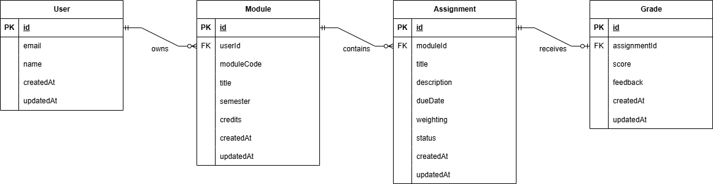

# Database Design Document

## UniHub

**Version:** 1.0
**Status:** Draft
**Last Updated:** June 2026

---

## 1. Purpose

This document defines the database architecture for UniHub.

The objective of the database is to provide secure, reliable, and scalable storage for all academic information managed by the application.

The database design supports:

- User accounts
- Authentication
- Modules
- Assignments
- Grades
- Dashboard analytics

This document serves as the foundation for:

- PostgreSQL schema design
- Prisma schema development
- API development
- Test data generation
- Future feature expansion

---

## 2. Database Technology

### Database Management System

PostgreSQL

#### Rationale

PostgreSQL was selected because it provides:

- Strong relational modelling
- ACID compliance
- Excellent performance
- Industry adoption
- Prisma support
- Free cloud hosting options

---

### ORM

Prisma ORM

#### Benefits

- Type-safe queries
- Automatic TypeScript types
- Migration support
- Developer productivity

---

## 3. Entity Relationship Overview



---

## 4. Entity Definitions

### 4.1 User

Represents a registered student.

#### Attributes

| Field     | Type     | Description                 |
| --------- | -------- | --------------------------- |
| id        | UUID     | Primary key                 |
| email     | String   | Unique email address        |
| name      | String   | Display name                |
| createdAt | DateTime | Account creation timestamp  |
| updatedAt | DateTime | Last modification timestamp |

#### Constraints

- Email must be unique.
- User must have a valid account.
- User owns all associated academic data.

---

### 4.2 Module

Represents a university module.

#### Attributes

| Field      | Type     | Description            |
| ---------- | -------- | ---------------------- |
| id         | UUID     | Primary key            |
| userId     | UUID     | Owner reference        |
| moduleCode | String   | Module identifier      |
| title      | String   | Module title           |
| semester   | Integer  | Semester number        |
| credits    | Integer  | Credit value           |
| createdAt  | DateTime | Creation timestamp     |
| updatedAt  | DateTime | Modification timestamp |

#### Examples

```text
COMP2010
Data Structures and Algorithms
20 Credits
Semester 1
```

#### Constraints

- Module belongs to one user.
- Module code required.
- Module title required.

---

### 4.3 Assignment

Represents coursework associated with a module.

#### Attributes

| Field       | Type     | Description             |
| ----------- | -------- | ----------------------- |
| id          | UUID     | Primary key             |
| moduleId    | UUID     | Parent module           |
| title       | String   | Assignment name         |
| description | String   | Optional details        |
| dueDate     | DateTime | Submission deadline     |
| weighting   | Decimal  | Percentage contribution |
| status      | Enum     | Progress status         |
| createdAt   | DateTime | Creation timestamp      |
| updatedAt   | DateTime | Modification timestamp  |

#### Status Values

```text
NOT_STARTED
IN_PROGRESS
COMPLETED
SUBMITTED
```

#### Constraints

- Assignment belongs to one module.
- Weighting must be between 0 and 100.

---

### 4.4 Grade

Represents an achieved assessment result.

#### Attributes

| Field        | Type     | Description            |
| ------------ | -------- | ---------------------- |
| id           | UUID     | Primary key            |
| assignmentId | UUID     | Related assignment     |
| score        | Decimal  | Grade percentage       |
| feedback     | String   | Optional feedback      |
| createdAt    | DateTime | Creation timestamp     |
| updatedAt    | DateTime | Modification timestamp |

#### Example

```text
Assignment: Coursework 1
Grade: 74%
```

#### Constraints

- Grade belongs to one assignment.
- Grade must be between 0 and 100.

---

## 5. Entity Relationships

### User → Module

Relationship:

```text
1 : N
```

A user may have many modules.

A module belongs to exactly one user.

Example:

```text
User
 ├── COMP2010
 ├── COMP2045
 └── COMP3050
```

---

### Module → Assignment

Relationship:

```text
1 : N
```

A module may contain multiple assignments.

An assignment belongs to exactly one module.

Example:

```text
COMP2010
 ├── Coursework 1
 ├── Coursework 2
 └── Examination
```

---

### Assignment → Grade

Relationship:

```text
1 : 0..1
```

An assignment may have a grade.

A grade belongs to exactly one assignment.

Example:

```text
Coursework 1
    ↓
Grade: 78%
```

---

## 6. Logical Database Schema

```text
User
----
id (PK)
email
name
createdAt
updatedAt

Module
------
id (PK)
userId (FK)
moduleCode
title
semester
credits
createdAt
updatedAt

Assignment
----------
id (PK)
moduleId (FK)
title
description
dueDate
weighting
status
createdAt
updatedAt

Grade
-----
id (PK)
assignmentId (FK)
score
feedback
createdAt
updatedAt
```

---

## 7. Foreign Key Constraints

### Module

```text
userId
REFERENCES User(id)
ON DELETE CASCADE
```

#### Behaviour

Deleting a user removes all modules.

---

### Assignment

```text
moduleId
REFERENCES Module(id)
ON DELETE CASCADE
```

#### Behaviour

Deleting a module removes all assignments.

---

### Grade

```text
assignmentId
REFERENCES Assignment(id)
ON DELETE CASCADE
```

#### Behaviour

Deleting an assignment removes associated grades.

---

## 8. Data Integrity Rules

## User

- Email must be unique.
- Email cannot be null.

---

### Module

- Module title required.
- Module code required.

---

### Assignment

- Weighting must be between 0 and 100.
- Due date required.

---

### Grade

- Score must be between 0 and 100.

---

## 9. Future Schema Expansion

The following entities may be introduced after MVP completion.

### Exam

```text
Exam
----
id
moduleId
title
date
weighting
```

---

### Study Session

```text
StudySession
------------
id
userId
startTime
endTime
duration
```

---

### Goal

```text
Goal
----
id
userId
title
targetDate
status
```

---

### Notification

```text
Notification
------------
id
userId
message
read
createdAt
```

---

## 10. Dashboard Calculations

The dashboard will derive data from stored entities.

### Assignment Completion Rate

Formula:

```text
completedAssignments
/
totalAssignments
× 100
```

### Module Average

Formula:

```text
Σ(score × weighting)
/
Σ(weighting)
```

### Upcoming Deadlines

Assignments where:

```text
dueDate > currentDate
```

ordered ascending by due date.

---

## 11. Security Considerations

The database shall enforce ownership through application-level authorisation.

Users shall never be able to access records belonging to another user.

All database queries shall be filtered using the authenticated user identifier.

Example:

```sql
SELECT *
FROM Module
WHERE userId = authenticatedUserId;
```

---

## 12. Migration Strategy

Database schema changes shall be managed through Prisma migrations.

All schema modifications shall:

- Be version controlled.
- Be reviewed before deployment.
- Be applied automatically during deployment pipelines.

---

## 13. Summary

The MVP database consists of four primary entities:

- User
- Module
- Assignment
- Grade

The design provides a simple, maintainable relational model that supports all MVP functionality while allowing future expansion without major architectural changes.
