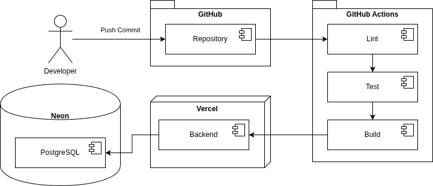

# DevOps Document

## UniHub

**Version**: 1.0
**Status**: Draft
**Last Updated**: June 2026

---

## 1. Purpose

This document defined the DevOps practices, CI/CD workflows, deployment processes, and operational procedures used by UniHub.

The objectives are to:

- Maintain code quality
- Automate testing
- Automate deployments
- Reduce human error
- Ensure consistent development practices

## 2. DevOps Principles

The project follows the following principles:

- Infrastructure as Code
- Automated Testing
- Continuous Integration
- Continuous Deployment
- Version Control
- Reproducible Builds

All production deployments shall be generated from source-controlled code.

## 3. Repository Structure

Repository:

```text
unihub/
│
├── src/
├── prisma/
├── tests/
├── scripts/
│
├── docs/
│
├── .github/
│   └── workflows/
│
├── README.md
└── .gitignore
```

## 4. Source Control Strategy

Git shall be used for source control.

Repository hosting:

```text
GitHub
```

## 5. Branching Strategy

The project shall use a simplified feature branch workflow.

### Main Branch

```text
main
```

Characteristics:

- Production-ready
- Protected branch
- Automatically deployed

### Feature Branches

Naming convention:

```text
feature/<feature-name>
```

Examples:

```text
feature/authentication
feature/module-management
feature/dashboard
feature/assignment-crud
```

All development work should occur on feature branches.

### Bug Fix Branches

Naming convention:

```text
fix/<issue-name>
```

Examples:

```text
fix/login-validation
fix/module-filtering
```

## 6. Pull Request Workflow

Development process:

```text
Create Branch
      ↓
Develop Feature
      ↓
Run Local Tests
      ↓
Open Pull Request
      ↓
GitHub Actions
      ↓
Merge to Main
      ↓
Automatic Deployment
```

Requirements before merge:

- Build passes
- Lint passes
- Tests pass

## 7. Continuous Integration

The project shall utilise GitHub Actions.

Workflow location:

```text
.github/workflows/
```

### CI Workflow

Trigger:

```yaml
on:
  push:
  pull_request:
```

Pipeline stages:

1. Install Dependencies
2. Lint
3. Type Check
4. Unit Tests
5. Integration Tests
6. Build Verification

### CI Pipeline Diagram



## 8. Continuous Deployment

Production deployments shall occur automatically:

Deployment trigger:

```text
Merge to main
```

### Backend Deployment

Platform:

```text
Render
```

Deployment method:

```text
GitHub Integration
```

Process:

```text
main
 ↓
GitHub
 ↓
Render Build
 ↓
Production Deployment
```

## 9. Environments

### Development

Purpose:

Local development

Examples:

```text
http://localhost:5173
http://localhost:3000
```

### Production

Purpose:

Public deployment

Examples:

```text
https://unihub.app
https://api.unihub.app
```

## 10. Environment Variables

Sensitive values shall never be committed to Git.

Environment variables shall be managed through deployment platforms.

### Backend Variables

```text
DATABASE_URL

BETTER_AUTH_URL

NODE_ENV
```

## 11. Secrets Management

Secrets shall be stored using:

- GitHub Secrets
- Render Environment Variables

Secrets must never be:

- Hardcoded
- Committed to source control
- Logged

## 12. Quality Gates

The following checks must pass before deployment.

### Linting

Tool:

```text
ESLint
```

Purpose:

- Code consistency
- Style enforcement
- Common bug pevention

### Formatting

Tool:

```text
Prettier
```

Purpose:

- Consistent code formatting.

### Type Chcking

Tool:

```text
TypeScript
```

Purpose:

Static analysis and compile-time verification.

### Testing

Tools:

```text
Vitest
Supertest
```

Purpose:

Verification of application behaviour.

## 13. Release Process

Release process:

```text
Feature Complete
       ↓
Pull Request
       ↓
CI Validation
       ↓
Merge to Main
       ↓
Automatic Deployment
       ↓
Production
```

No manual production deployments should be required.

## 14. Monitoring and Logging

Initial MVP monitoring will rely on platform tooling.

### Render

Provides:

- API logs
- Deployment logs
- Runtime logs

### Database

Neon provides:

- Query monitoring
- Connection monitoring
- Usage metrics

## 15. Backup and Recovery

Database backups shall be managed by Neon.

Recovery strategy:

1. Restore latest backup.
2. Redeploy application.
3. Verify integrity.

## 16. Future Enhancements

Potential future DevOps improvements:

- Docker containers
- Infrastructure as Code
- Preview deployments
- End-to-end testing
- Monitoring dashboards
- Error tracking with Sentry

## 17. Summary

UniHub utilises a modern DevOps workflow based on:

- GitHub
- GitHub Actions
- Render
- Neon PostgreSQL

The workflow enables automated testing, continuous integration, and continuous deplopyment while maintaining code quality and deployment reliability.
