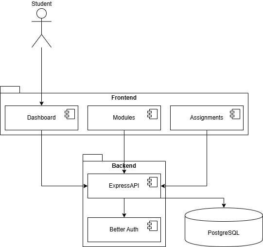
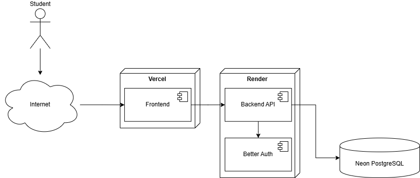

# System Architecture Document

## UniHub

**Version:** 1.0
**Status:** Draft
**Last Updated:** June 2026

---

## 1. Purpose

This document defines the overall software architecture of UniHub.

The architecture describes:

- System components
- Responsibilities of each component
- Communication between components
- Authentication mechanisms
- Deployment structure
- Design principles

This document serves as the primary technical reference for implementation.

## 2. Architectural Overview

UniHub follows a three-tier architecture consisting of:

1. Frontend Client
2. Backend API
3. Database Layer

The architecture separates presentation, business logic, and persistence concerns.

Benefits include:

- Maintainability
- Scalability
- Testability
- Clear separation of responsibilities

## 3. Technology Stack

### Frontend

- React
- TypeScript
- Vite
- Tailwind CSS
- React Router
- TanStack Query

#### Responsibilities

- User interface rendering
- Form validation
- Client-side routing
- API communication
- Session-aware navigation

### Backend

- Node.js
- Express
- TypeScript

#### Responsibilities

- Business logic
- Request validation
- Authentication enforcement
- Database access
- API responses

### Authentication

- Better Auth

#### Responsibilities

- User registration
- User authentication
- Session management
- Access control

### Database

- PostgreSQL
- Prisma ORM

#### Responsibilities

- Data persistence
- Relational integrity
- Query execution
- Transaction management

## 4. Logical Architecture

The logical architecture illustrates how software components interact.



### Description

The frontend communicates with the backend through REST APIs.

The backend processes requests, applies business logic, performs authentication checks, and interacts with the database through Prisma.

### Communication Flow

```text
User
  ↓
Frontend
  ↓
REST API
  ↓
Backend
  ↓
Prisma
  ↓
PostgreSQL
```

## 5. Deployment Architecture

The deployment architecture illustrates where components are hosted.



### Hosting Strategy

| Component      | Platform        |
| -------------- | --------------- |
| Frontend       | Vercel          |
| Backend        | Render          |
| Database       | Neon PostgreSQL |
| Source Control | GitHub          |
| CI/CD          | GitHub Actions  |

### Deployment Flow

```text
Developer
    ↓
GitHub
    ↓
GitHub Actions
    ↓
Deploy
    ↓
Production Environment
```

## 6. Authentication Architecture

Authentication is managed through Better Auth.

Authenticated users may access protected resources.

Unauthenticated users shall be redirected to login functionality.

### Diagram Placement

Insert:

```text
docs/diagrams/authentication-flow.png
```

immediately below this section.

#### Authentication Flow

1. User submits credentials.
2. Frontend sends authentication request.
3. Backend forwards request to Better Auth.
4. Better Auth validates credentials.
5. Session is established.
6. User receives authenticated access.

## 7. Application Structure

The project shall use a monorepo structure.

```text
root/
│
├── frontend/
│
├── backend/
│
├── docs/
│
└── .github/
```

## 8. Frontend Architecture

The frontend shall follow a feature-oriented structure.

```text
frontend/src
│
├── components/
├── pages/
├── features/
├── hooks/
├── services/
├── types/
├── layouts/
└── routes/
```

### Responsibilities

#### Components

Reusable UI elements.

#### Pages

Route-level screens.

#### Features

Business-specific functionality.

#### Services

API communication.

#### Hooks

Reusable React logic.

## 9. Backend Architecture

The backend shall follow a layered architecture.

```text
backend/src
│
├── controllers/
├── services/
├── repositories/
├── middleware/
├── routes/
├── validators/
├── types/
└── utils/
```

### Controllers

Handle HTTP requests and responses.

Example:

```text
ModuleController
AssignmentController
AuthController
```

### Services

Contain business logic.

Example:

```text
ModuleService
AssignmentService
GradeService
```

### Repositories

Handle database interaction.

Example:

```text
ModuleRepository
AssignmentRepository
```

### Middleware

Cross-cutting concerns.

Examples:

- Authentication
- Error handling
- Request logging

## 10. API Design Principles

The backend shall expose a REST API.

### Example Routes

#### Authentication

```http
POST /api/auth/register
POST /api/auth/login
POST /api/auth/logout
```

### Modules

```http
GET    /api/modules
POST   /api/modules
GET    /api/modules/:id
PUT    /api/modules/:id
DELETE /api/modules/:id
```

#### Assignments

```http
GET    /api/assignments
POST   /api/assignments
PUT    /api/assignments/:id
DELETE /api/assignments/:id
```

#### Grades

```http
GET    /api/grades
POST   /api/grades
PUT    /api/grades/:id
```

## 11. Security Architecture

### Authentication

Managed using Better Auth.

### Authorisation

Users may only access resources they own.

Example:

A user may not access another user's:

- Modules
- Assignments
- Grades

### Environment Variables

Sensitive values shall be stored using environment variables.

Examples:

```text
DATABASE_URL
BETTER_AUTH_SECRET
BETTER_AUTH_URL
```

## 12. Error Handling Strategy

The application shall provide consistent error responses.

Example:

```json
{
  "error": "Module not found"
}
```

The backend shall never expose internal implementation details.

## 13. Logging Strategy

The backend shall log:

- Server startup
- Authentication events
- Errors
- Database failures

Sensitive information shall never be logged.

Examples:

- Passwords
- Session tokens
- Secrets

## 14. Scalability Considerations

The architecture should support future expansion.

Potential future additions include:

- Notifications
- Revision planner
- Calendar integration
- Analytics
- Mobile applications

The separation of frontend, backend, and database layers supports incremental feature growth.

## 15. Summary

UniHub adopts a modern full-stack architecture consisting of:

- React frontend
- Express backend
- Better Auth authentication
- PostgreSQL database
- Prisma ORM
- GitHub Actions CI/CD

This architecture provides a maintainable and scalable foundation for current MVP requirements and future enhancements.
